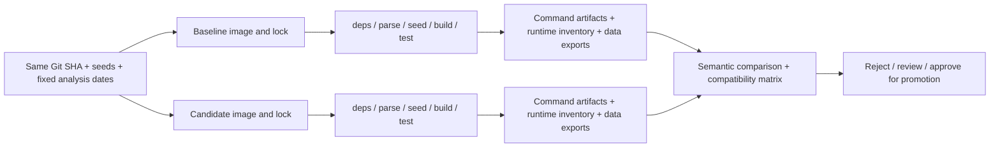

# Reproducible dbt Upgrade Lab

Dependency and environment reproducibility are part of data transformation reliability.

## Current status

Phase 5 complete: locked Docker environments, a working SaaS dbt project, semantic comparison, hosted GitHub Actions, and a verified retained-image recovery drill. Both environments passed all five dbt commands and 46 data tests. All 52 compiled model/test SQL hashes and all nine exported seed/model relations matched.

Inspect the [successful hosted workflow](https://github.com/Etti95/reproducible-dbt-upgrade-lab/actions/runs/34906995612), [deliberately failing workflow](https://github.com/Etti95/reproducible-dbt-upgrade-lab/actions/runs/34930708294), and [measured CI/recovery results](docs/phase5-results.md). The red run injected a labeled artifact mutation; it does not represent a real dbt regression. The complete migration/promotion runbook and retrospective are the final phase.

Start with the [environment exercise](docs/environments.md), [measured results](docs/phase2-results.md), and [a real dependency failure encountered during implementation](docs/toolchain-failure.md).

## Reproduce the experiment

Requirements: Git, Python 3.9+ for the standard-library host scripts, and Docker with Linux/AMD64 support. The actual dbt runtime uses pinned Python 3.12.11 inside the images. Network access is needed to clone/build; validation runs offline.

```bash
git clone https://github.com/Etti95/reproducible-dbt-upgrade-lab.git
cd reproducible-dbt-upgrade-lab
```

```bash
python3 scripts/environment.py baseline
python3 scripts/environment.py candidate
```

These commands build and inspect each runtime. They require a running Docker daemon and network access during image builds. Both currently verify 54 locked packages; only dbt Core differs (1.10.11 → 1.10.13).

Run the baseline transformations:

```bash
python3 scripts/run_project.py baseline
```

Expected: 6 models, 3 seeds, 46 passing data tests; eight customers and USD 660 MRR at September 7, 2026. The runner prints the new evidence directory. See [metric definitions and exercises](docs/metrics.md) and [measured baseline results](docs/phase3-results.md).

Run both environments and generate the compatibility matrix:

```bash
python3 -m unittest discover -s scripts/tests -v
python3 scripts/run_comparison.py
```

Expect 23 passing guardrail tests, then `Compatibility exit=0` and a path to `report/compatibility.md`. Exit 1 means failure; exit 2 requires review. Both block promotion. Uncommitted inputs deliberately require review even when the content matches. Read [how the comparison works](docs/artifact-comparison.md) before interpreting a green result as upgrade approval.

The safeguards address different risks: image digests and hashed locks fix runtime inputs; artifact/data comparison detects changed behavior; business tests establish the fixture's expected meaning. Successful SQL alone provides none of those assurances in full.

## CI and recovery

The [workflow](.github/workflows/dbt-compatibility.yml) independently builds baseline and candidate from the same Git SHA, uploads evidence even after failures, then compares it in a separate job. A recovery job rejects a copied manifest mutation, loads the checksummed baseline image archive on a fresh runner, and verifies that rerunning baseline reproduces its original outputs. See the [YAML walkthrough and reproduction commands](docs/ci-and-rollback-drill.md).

Artifacts are retained for 30 days. Production rollback would need durable image/evidence retention and a separate plan for restoring changed warehouse data. The lab does not deploy to a production warehouse.

An unchanged Git commit can run differently after a rebuild if package resolution or a base image changes. This lab will hold SaaS models and seed data constant while independently building a known-good dbt Core + DuckDB environment and a candidate upgrade.

See [verified incident context](docs/incident-context.md), [architecture and decisions](docs/architecture.md), and [the phased learning guide](docs/learning-guide.md).



## Planned repository

```text
README.md
dbt_project.yml             # One shared transformation project
profiles.yml.example        # Credential-free local DuckDB profile
models/{staging,intermediate,marts}/
seeds/                     # Fixed, version-controlled source fixtures
macros/                    # Small, inspectable shared SQL logic
tests/                     # Business invariant data tests
scripts/                   # Shared runner, data export, semantic comparator
environments/{baseline,candidate}/
  Dockerfile
  requirements.in          # Exact direct dependency intent
  requirements.txt         # Generated transitive lock with hashes
artifacts/                 # Ignored generated evidence, split by environment/command
docs/                      # Architecture, guided exercises, migration and rollback
.github/workflows/dbt-compatibility.yml
```

We use this workspace as the repository root rather than adding another nested project directory. Files listed above are planned unless already present.

## Learning sequence

1. Architecture: define controlled variables and evidence.
2. Environments: verify version pairs; generate locks; build and inspect images.
3. Analytics: implement and validate subscription/customer-day metrics.
4. Evidence: run both environments and compare artifacts and data.
5. CI and failure drill: execute the same runner in Actions; prove rejection works.
6. Operations: finish migration/rollback runbooks and the engineering retrospective.

Commands and measured example results will be added as each phase is executed. No hypothetical results will be presented as successful validation.
