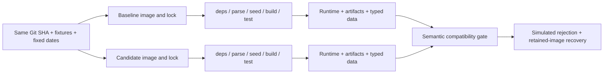

# Reproducible dbt Upgrade Lab

**Dependency and environment reproducibility are part of data transformation reliability.** An unchanged Git commit can behave differently after a rebuild if its CLI, transitive dependencies or base image changes.

This completed lab runs the same SaaS subscription models and fixtures in two isolated dbt Core + DuckDB environments, compares behavior, and rehearses recovery from a retained image.

## Problem and scope

The motivating incident is PyPI's announcement that the `dbt` package name changes from the Cloud CLI to dbt v2 starting September 14, 2026. An unpinned `pip install dbt` can therefore change tool identity without a SQL change. The announcement was verified; this lab does not claim to have observed a fresh resolver switch. See [facts and assumptions](docs/incident-context.md).

The working experiment is a deliberate **Core 1.10.11 → 1.10.13** upgrade, not a Cloud CLI-to-v2 migration. These are historical lab versions, not a recommendation for a new production stack.

| Component | Baseline | Candidate |
| --- | --- | --- |
| Python / platform | 3.12.11 / linux/amd64 | Same |
| dbt Core | 1.10.11 | 1.10.13 |
| DuckDB adapter / engine | 1.9.6 / 1.3.2 | Same |
| Dependency closure | 54 hashed package pins | Only Core differs |

Both Dockerfiles pin the Python image digest. Runtime installs require package hashes and wheels. Docker packages the environment; mutable Dockerfile inputs would still produce mutable builds.

## Measured results

- [Successful hosted CI](https://github.com/Etti95/reproducible-dbt-upgrade-lab/actions/runs/34906995612): both environments passed deps/parse/seed/build/test and **46 distinct dbt tests**; all **52 compiled model/test SQL hashes** and **nine typed relation exports** matched.
- [Intentional red CI](https://github.com/Etti95/reproducible-dbt-upgrade-lab/actions/runs/34930708294): both environments passed dbt, but a labeled copied-manifest `table → view` mutation failed the compatibility gate.
- The successful run restored the checksummed baseline image on a fresh runner, reran validation without rebuilding, and reproduced the original outputs. **23 guardrail tests** also passed.

Read the [compatibility matrix](docs/ci-compatibility-matrix.md), [failure matrix](docs/simulated-failure-matrix.md), and [hosted evidence](docs/phase5-results.md). The injected mutation is simulated; image restoration is real. No production system was deployed.

## Architecture



Three seeds feed three staging views, `int_customer_subscription_daily`, `fct_customer_daily`, and `mart_customer_health`. Subscription intervals are start-inclusive/end-exclusive; MRR and usage are aggregated independently before joining. Edge cases cover plan changes, cancellation, concurrent addons, reactivation and inactive customers. [Metric definitions](docs/metrics.md)

## Run it

Requirements: Git, Python 3.9+ for standard-library host scripts, and Docker with Linux/AMD64 support. dbt itself runs with pinned Python 3.12.11 inside containers. Image builds need network access; validation runs offline.

```bash
git clone https://github.com/Etti95/reproducible-dbt-upgrade-lab.git
cd reproducible-dbt-upgrade-lab
python3 scripts/environment.py baseline
python3 scripts/environment.py candidate

# Inspect installed reality.
cat artifacts/baseline/environment/dbt-version.txt
cat artifacts/candidate/environment/pip-freeze.txt

# Run either environment independently.
python3 scripts/run_project.py baseline
python3 scripts/run_project.py candidate

# Run both from one frozen snapshot and compare.
python3 -m unittest discover -s scripts/tests -v
python3 scripts/run_comparison.py
```

Expect 23 passing guardrail tests, `Compatibility exit=0`, and a printed report path under `artifacts/comparisons/<run-id>/report/`. Each environment produces eight customer-health rows and **USD 660.00 MRR** at September 7. Exit 1 fails; exit 2 requires review. Uncommitted inputs deliberately require review.

The comparator validates evidence completeness, schemas and execution coverage before comparing selected graph/configuration fields, exact compiled SQL hashes, statuses and typed data. Timestamps and invocation IDs are not blindly diffed; invocation IDs still detect mixed files within a run. [Inspection exercises and diagnostics](docs/artifact-comparison.md)

## CI, promotion and rollback

[GitHub Actions](.github/workflows/dbt-compatibility.yml) builds the two environments independently from one SHA, retains evidence even after failures, and compares it in a separate job. A recovery job loads the exact retained baseline image. Actions use commit SHAs; dependency locks are consumed, not regenerated, during validation. [YAML walkthrough](docs/ci-and-rollback-drill.md)

The [migration runbook](docs/migration_runbook.md) gives exact versions, acceptance/rejection criteria, tested recovery commands and post-deployment checks. Rollback binds the image/archive checksum to the original Git revision, locks and inputs. It does not mean installing a vaguely specified older version, and it does not automatically undo changed warehouse data.

Hosted artifacts have 30-day retention. Durable image/evidence retention and a separate data restore plan are required before production promotion. The candidate passed this lab; there is no claimed production approval.

## Repository and learning path

```text
models/ + seeds/ + macros/ + tests/    shared transformation project
analyses/                            inspectable business readout
scripts/                             build, validate, compare, simulate, restore
scripts/tests/                       comparator and recovery guardrails
environments/{baseline,candidate}/   Dockerfiles, direct pins, hashed locks
environments/toolchain/             locked pip-tools compiler
artifacts/                           ignored generated evidence/databases
docs/                                definitions, exercises, reports, runbook
.github/workflows/                   hosted compatibility and recovery
```

Follow the [six-phase learning guide](docs/learning-guide.md), [architecture decisions](docs/architecture.md), and [retrospective/explanation](docs/engineering-retrospective.md).

The main lessons: an identical source revision is not an identical runtime; a reproducible environment can still be wrong; and passing SQL does not prove unchanged behavior. Locks/digests control inputs, artifact/data comparison evaluates changes, and business tests establish the intended metric meaning.
