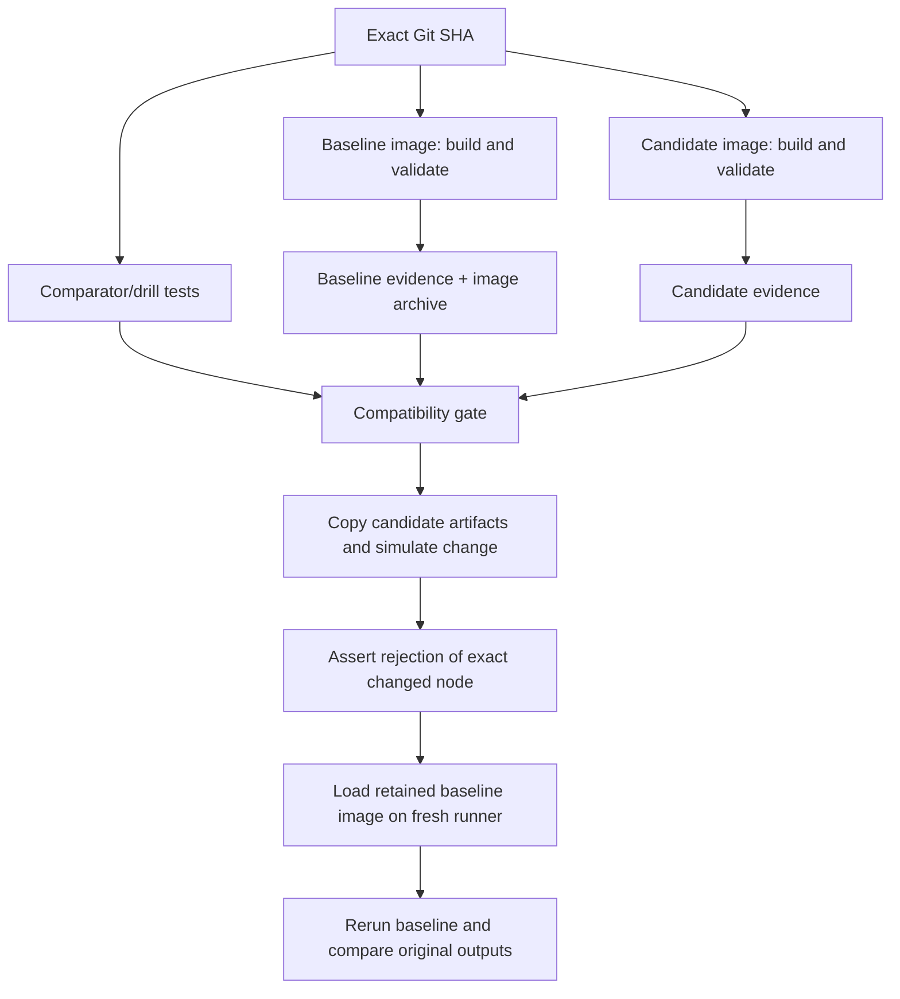

# Phase 5 — Hosted validation, rejection, and recovery

## Engineering objective

Turn the local experiment into a repeatable CI gate. A failed environment must leave useful evidence, and rollback must reuse a retained known-good runtime rather than resolve dependencies again.

The implementation lives in `.github/workflows/dbt-compatibility.yml` and calls the same Python runners used locally. No dbt packages are installed on the GitHub host; dbt runs inside the locked Docker images.



## Workflow design, section by section

**Triggers.** Pushes to main, pull requests, and manual dispatch run the workflow. Documentation-only pushes are excluded because they cannot change runtime inputs. PR validation still runs. The manual boolean `simulate_failure` is false by default; true creates an intentionally failing comparison using labeled copied evidence.

**Permissions.** The workflow token has only `contents: read`. Checkout does not persist Git credentials. This task does not deploy data, publish packages, or post messages. Actions artifacts use the platform's artifact service. The source snapshot copies only explicit project/configuration directories; it does not include `.git`, `.env`, or host profiles.

**Pinned actions and runner.** Checkout, Python setup, artifact upload and artifact download are pinned to full official repository commit SHAs. The SHAs were resolved from checkout v4, setup-python v5, upload-artifact v4 and download-artifact v4 on September 14, 2026. Host scripts use Python 3.12.11. `ubuntu-24.04` fixes the runner family, but GitHub can update that runner and Docker daemon. The dbt runtime is fixed separately by its base-image digest, platform and dependency lock; this is not a claim of bit-for-bit reproducibility of the entire hosted VM.

**Concurrency and timeouts.** Runs on the same ref/event are queued rather than canceled mid-evidence collection. Every job has a timeout. These controls prevent unbounded work without confusing interrupted evidence with successful validation.

**Guardrail tests.** A separate job runs the comparator and failure-drill unit tests. It checks decision boundaries such as missing results, changed data with unchanged counts, corrupt image archives, and preserving original evidence during simulation.

**Environment matrix.** Baseline and candidate independently check out `${{ github.sha }}`, build their images, capture runtime inventories, and run the shared offline validation pipeline. `fail-fast: false` allows the second environment to finish if the first fails. Each run gets its own source snapshot, database, and target directories. Source hashes and Git provenance establish that the matrix inputs agree; runner labels are not proof of equality.

**Evidence retention.** Upload steps use `if: always()` to retain partial logs after failure. Distinct names (`evidence-baseline` and `evidence-candidate`) prevent collisions. Each bundle contains image build logs, source snapshots, inventories, command exits/logs, manifests, run results, typed exports and the synthetic DuckDB database. `include-hidden-files` is intentional for the explicitly copied `.github`, `.python-version` and `.dockerignore` files. There are no credentials in those copied inputs.

**Retained image.** After successful baseline validation, the image archive script saves that exact image ID to `baseline-image.tar.gz`, records its SHA-256, and binds the archive to the Git/source/lock hashes. The archive is a separate artifact to keep comparison downloads small. It is not rebuilt in the rollback job.

**Comparison job.** `needs` waits for both matrix jobs and guardrail tests; job-level `always()` allows comparison after failure. Artifact download may fail, but the comparator still runs and reports missing evidence as a critical failure. The report and job summary are uploaded even when comparison exits 1 (failure) or 2 (review). A final step also requires successful upstream jobs, preventing an image-retention or guardrail failure from being hidden by a passing comparison.

**Rollback drill.** On a genuine compatible run, a fresh job downloads evidence and the baseline image archive. It first verifies the genuine comparison. It then copies candidate evidence and changes `mart_customer_health` from table to view in the manifests from all commands, preserving within-run consistency. The comparator must reject precisely that node. Finally, the job verifies the archive checksum, loads the recorded baseline image, checks its identity/source/lock binding, reruns deps/parse/seed/build/test, and compares the restored graph, SQL, execution statuses and typed data against the original baseline.

**Manual failing run.** Setting `simulate_failure=true` injects the same mutation before the real comparison step. That step returns 1 and the workflow is intentionally red; the rollback job is skipped because its prerequisite failed. The normal successful workflow separately demonstrates recovery. This provides a visible failing gate without committing broken models or misrepresenting actual dbt behavior.

## What the drill proves

```text
Copied candidate manifest: table → view (SIMULATED)
    ↓
Comparator identifies the model and exits 1
    ↓
Preserved original artifacts + labeled failure report
    ↓
Decision: reject the hypothetical candidate
    ↓
Verify archive checksum and load the recorded baseline image ID
    ↓
Run the baseline in a fresh database without rebuilding dependencies
    ↓
Verify original baseline behavior and data are restored
```

The mutation is synthetic; image restoration and dbt execution are real. Original evidence is never edited. This is environment recovery into a new DuckDB database, not restoration of production tables changed by an upgrade.

## Commands to run and expected outcomes

After pushing workflow/code changes:

```bash
# Inspect the automatic run.
gh run list --workflow dbt-compatibility.yml --limit 5

# Start a normal full validation and recovery drill.
gh workflow run dbt-compatibility.yml --ref main

# Start a deliberately red run. The input makes its meaning explicit.
gh workflow run dbt-compatibility.yml --ref main -f simulate_failure=true

# Inspect one selected run and download its evidence.
gh run view <run-id>
gh run download <run-id> --dir artifacts/hosted/<run-id>
```

Expected normal outcome: both validation matrix jobs, the compatibility gate, guardrail tests and recovery drill pass. Expected simulated outcome: both environments still pass dbt, but the compatibility gate fails on the materialization and the recovery job is skipped. Find `SIMULATED FAILURE` in the retained comparison report. Do not treat the deliberately red run as a real Core incompatibility.

For a local end-to-end drill, first run and retain a fresh comparison from the current clean checkout, then use its paths:

```bash
python3 scripts/run_comparison.py
python3 scripts/image_archive.py save artifacts/local-baseline-image \
  --evidence artifacts/comparisons/<run-id>/baseline
python3 scripts/failure_rollback_drill.py \
  --baseline artifacts/comparisons/<run-id>/baseline \
  --candidate artifacts/comparisons/<run-id>/candidate \
  --image-archive artifacts/local-baseline-image \
  --output artifacts/local-drill
```

The archive and drill output directories must be new; scripts refuse to overwrite existing evidence. Local execution proves load/reuse, while the hosted drill additionally runs on a fresh VM with no baseline image preloaded.

## Diagnose common failures

- **Build fails:** open the matrix artifact's `image/build.log`. Do not regenerate locks in CI to work around a resolver or hash failure.
- **Missing artifact:** compare should fail with the missing file path. Check the upstream job; do not accept a match between incomplete inputs.
- **Dirty source or different SHA:** inspect each `source.json`. Both jobs must use the same checkout; generated files belong under ignored `artifacts/`.
- **Comparison fails:** inspect the named check and node details before raw JSON. A review exit also blocks the job.
- **Archive checksum fails:** do not load it. Restore another retained approved artifact; never substitute a mutable image tag.
- **Rollback source differs:** check out the archive's recorded Git SHA and use its source snapshot/lock. Reusing an old image with new transformation code is not the same experiment.
- **Rollback outputs differ:** retain both runs and investigate before declaring recovery complete.

## Retention and production boundary

All lab artifacts have 30-day retention. Record run URL, run attempt, Git SHA, source hash, locks, image ID/archive checksum, reports and artifacts for each approved release. The CI source evidence records the hosted run URL automatically.

Artifact expiry means these uploads are not a permanent production image registry. Before real promotion, retain the approved image in durable storage or a registry with an immutable manifest digest, plus approval records and data recovery procedures. A Docker local image ID and an archive checksum are distinct from a registry manifest digest. This lab uses the former honestly and does not invent a registry digest.

The workflow fails on incompatible evidence, but repository branch protection is a separate GitHub setting. Require the compatibility and recovery checks before merges if adopting this as a team workflow. No production deployment or branch-protection change is implied here.

References: [workflow syntax](https://docs.github.com/en/actions/reference/workflows-and-actions/workflow-syntax), [artifact retention and transfer](https://docs.github.com/en/actions/tutorials/store-and-share-data), [upload-artifact](https://github.com/actions/upload-artifact).

## Reasoning checkpoint

Why save the image if the lock is already committed? A lock identifies acceptable package versions/bytes, but rebuilding still requires those bytes and the base image to remain downloadable. Loading a retained image avoids that resolution/download dependency during recovery.
