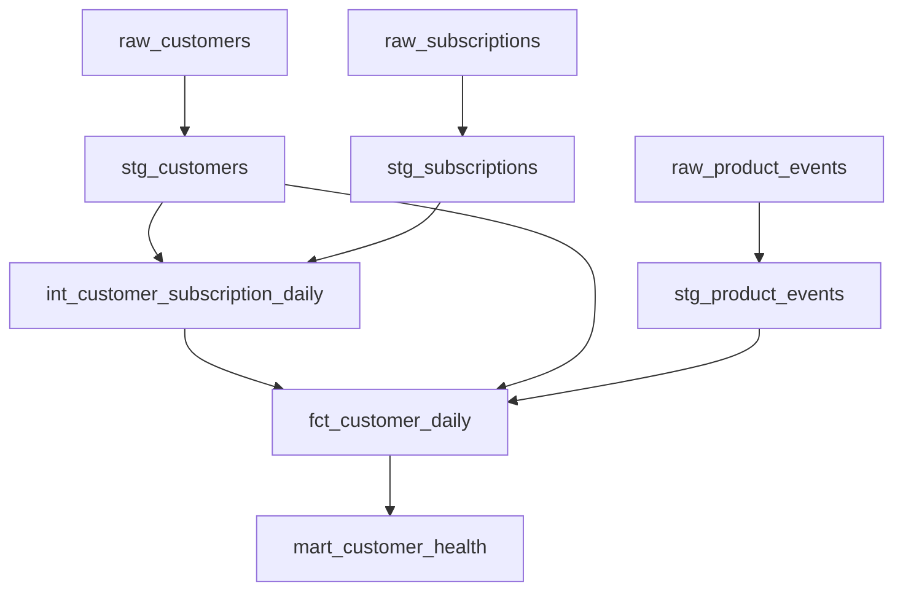

# Phase 3 — Subscription analytics with explicit business rules

## Business question and contract

Which customers have paid subscription MRR at September 7, 2026, and which of those customers have no meaningful product usage in the September 1–7 window?

All data is synthetic. The fixtures are assumed to contain complete customer records, complete constant-price subscription intervals, and complete product events for this analysis. Consequently, a missing matching interval or event is a financial/usage zero. In a real ingestion pipeline, missing observations cannot be interpreted as zero without source completeness and freshness checks.

| Decision | Rule and implication |
| --- | --- |
| Population | All customers from signup through the analysis end date, bounded by the analysis start date. Include unpaid and inactive customers. |
| Daily grain | One row per customer per eligible UTC calendar day; 52 rows for this fixture. |
| Money | USD `decimal(18,2)` contracted monthly run rate; no FX, proration, tax, invoicing or recognized revenue. Do not sum daily MRR to report revenue. |
| Interval | Start inclusive, end exclusive. Null end means open-ended. A price change closes one interval and opens another. |
| Status | Current operational metadata, not the authority for historical MRR. Cancelled subscriptions can contribute on earlier dates. |
| Overlap | Concurrent subscriptions/addons are valid and additive; duplicate subscription IDs fail tests. |
| Events | Source timestamps represent UTC. `login` counts as an event; only `project_created` and `report_exported` count as meaningful usage. |
| Health | Zero MRR → `no_paid_subscription`; positive MRR with no meaningful window events → `needs_attention`; otherwise `engaged`. This is an illustrative rule, not a churn prediction. |
| Segments | Country and segment are current customer attributes. Historical segment migration is out of scope. |
| Invalid data | Preserve raw strings in seeds. Strict date/amount casts and tests fail bad inputs; do not drop rows or replace failed casts with zero. |

The later signup customer has only three eligible days. Its usage window is therefore shorter; the health label deliberately describes observed activity rather than a normalized engagement rate.

## Model boundaries



Staging uses views and deterministic casts. The intermediate view expands the customer/date population and sums subscription intervals. The fact table separately aggregates events before joining to customer-day MRR. The health table selects the fixed end date and joins usage across the analysis window.

Why aggregate first? C005 has two simultaneous subscriptions and two events on September 4. Joining raw subscriptions to raw events would produce four rows and could double MRR. The fact model instead joins one subscription aggregate to one event aggregate, retaining USD 150 and two events.

No `source()` wrapper is used: the inputs are dbt-managed seeds, so `ref()` expresses the true lineage. `deps` is retained as a no-op without third-party dbt packages. Full builds are sufficient for 52 customer-days; an incremental model would add late-arrival and update semantics without helping this experiment.

## Fixture behaviors to inspect

| Customer | Deliberate edge case | Expected outcome |
| --- | --- | --- |
| C001 | Two events on one day; events immediately outside the window | MRR 100; three meaningful events over two active days in the window |
| C002 | Plan change on September 4 | MRR 200 on September 3; 300 on September 4, never 500 |
| C003 | Subscription ends September 7 | MRR 80 on September 6; zero on September 7 despite recent usage |
| C004 | No subscription; login only | Zero MRR and zero meaningful usage; customer is retained |
| C005 | Overlapping addon plus multiple events | MRR 150 from September 3 onward, without fanout |
| C006 | Cancellation gap and reactivation | MRR 50 → 0 → 70 on the documented effective dates |
| C007 | Subscription starts after analysis_end | Zero MRR on September 7 |
| C008 | September 5 signup; no events | Three customer-days; MRR 40 and `needs_attention` |

## Validation layers

Built-in generic tests check unique and non-null entity keys, foreign keys, and allowed categories. Accepted-value and relationship tests are paired with `not_null` where required; these tests alone do not reject every null. Custom generic tests enforce nonnegative metrics and the composite customer-day grain.

Singular SQL tests check interval validity, events before signup, source-to-stage row conservation, complete customer-day coverage, and source MRR reconciliation. The fixture tests separately encode hand-calculated amounts, boundary dates, and full expected health output. They do not call the model's macro to derive the expected results. Missing rows and null outputs must fail, not disappear through an inner join.

The `fixture_contract` tests intentionally assume the committed fixtures and September 1–7 window. Changing those inputs requires reviewing the expectations; it is not an environment-only upgrade anymore.

## Run and inspect

```bash
python3 scripts/run_project.py baseline
```

This requires the Phase 2 image. If it is missing, build it with `python3 scripts/environment.py baseline`. The runner mounts the project read-only, selects the image by local immutable ID, disables networking, and creates a new persistent evidence directory with a fresh DuckDB database. It creates the profile inside the container; no credentials or host profile are needed.

It runs `deps`, `parse`, `seed`, `build`, and `test`. Each command has a separate target/log directory so the final test command cannot overwrite build evidence. No partial-parse cache is shared. `build` includes seeds and tests; explicit `seed` and `test` runs make their command behavior visible, not additional independent test coverage. See [dbt build documentation](https://docs.getdbt.com/reference/commands/build) and [data test configuration](https://docs.getdbt.com/reference/resource-properties/data-tests).

The runner prints the evidence path. Inspect these files inside it:

```text
commands.json                       arguments and exit codes
environment/dbt-version.txt         actual CLI version for this run
parse/target/manifest.json           parsed project graph
build/target/manifest.json           built graph and compiled model SQL
build/target/run_results.json        model, seed, and test execution results
test/target/run_results.json         separate test-only invocation
customer_health.csv                 ordered, human-readable business output
lab.duckdb                          database for direct SQL inspection
```

Expected headline: eight customers and USD 660 of MRR at September 7. The measured command outcomes and test counts are recorded in `phase3-results.md` after execution.

## Diagnose and reason

- Parse failure: inspect `parse/console.log`; YAML/Jinja/configuration can fail before SQL execution.
- Cast failure: inspect the failing staging model and raw seed cell. Preserve the input and correct the source contract or fixture intentionally.
- Relationship failure: inspect the orphan before joins hide it. Do not remove the test or drop the customer silently.
- MRR reconciliation failure: check join cardinality and date boundaries; successful SQL execution does not prove monetary correctness.
- Health fixture failure: inspect the full customer row, not just a total. Compensating differences can leave company MRR unchanged.
- Downstream `SKIP` during build: inspect the first failed upstream node/test. A skipped model is not a passing model.
- A failed run keeps its evidence; rerunning uses a fresh directory rather than mixing stale and current artifacts.

Reasoning checkpoint: C003 used the product recently but has zero end-date MRR. Under this contract it is `no_paid_subscription`, not `engaged`. If customer success wants post-cancellation engagement separately, add a distinct metric rather than quietly changing this label's meaning.
